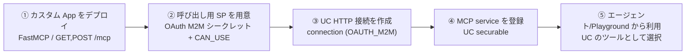

# custom_mcp_with_databricks_apps

Databricks Apps を使って作成したカスタム MCP（Model Context Protocol）サーバー集です。
いずれも Python の [FastMCP](https://github.com/jlowin/fastmcp) で実装し、streamable-HTTP
トランスポートで Databricks Apps プラットフォーム上にデプロイしたうえで、**Unity Catalog の
securable オブジェクト（Unity AI Gateway の MCP service）として登録**して統制下で利用できる
ようにしています。

## 収録している MCP

| ディレクトリ | 対象 API | 概要 | ツール数 |
|--------------|----------|------|:---:|
| [`qiita-mcp/`](qiita-mcp/) | [Qiita API v2](https://qiita.com/api/v2/docs) | 記事の検索・取得、ユーザー/タグ/コメント/ストックの参照、記事の投稿・更新・削除・ストックなど | 17 |
| [`frankfurter-mcp/`](frankfurter-mcp/) | [Frankfurter API](https://frankfurter.dev) | 中央銀行（ECB）公表の為替レート。最新/過去/期間レート、通貨換算、通貨一覧 | 8 |

各ディレクトリの `README.md` にツール一覧・ローカル実行・デプロイ手順をまとめています。

## 共通アーキテクチャ

- **実装**: `FastMCP` でツールを定義し、`mcp.http_app(path="/mcp")` を Starlette アプリに
  マウント。ルート `/` はヘルスチェック用の JSON を返す。
- **ランタイム**: `0.0.0.0:$DATABRICKS_APP_PORT` にバインド（Databricks Apps 仕様）。
- **MCP エンドポイント**: `https://<app-url>/mcp`
- **認証**: アプリ自体は Databricks OAuth の背後にある。MCP クライアントはワークスペースの
  トークン（`databricks auth token`）か、Unity Catalog 接続に紐づくサービスプリンシパルの
  OAuth トークンで接続する。

---

# カスタム App のデプロイ → Unity Catalog オブジェクトとして利用するまで

MCP を「作って終わり」ではなく、**Unity Catalog で統制（アクセス制御・監査・リネージ）された
ツール**として使えるようにするまでの全手順です。大きく次の 5 ステップに分かれます。



| レイヤ | 実体 | 役割 |
|--------|------|------|
| Databricks App | `qiita-mcp` / `frankfurter-mcp` | MCP サーバー本体（`/mcp` で streamable-HTTP を提供） |
| UC Connection (HTTP) | `qiita_mcp_conn` / `frankfurter_mcp_conn` | App への到達先 + 認証（OAuth M2M）を保持する securable |
| UC MCP Service | `<catalog>.<schema>.qiita_mcp` など | 接続を参照してツールを公開する securable。**これがガバナンスの単位** |
| 呼び出し SP | `mcp-gateway-caller` | App を叩くための最小権限プリンシパル（接続に資格情報を格納） |

> 前提権限: App のデプロイ権限、サービスプリンシパルの作成権限、登録先スキーマに対する
> `CREATE_SERVICE` + `USE_SCHEMA`（親カタログに `USE_CATALOG`）、接続への `USE_CONNECTION`。
> `ai-gateway` 系コマンドは **Beta** です（将来仕様変更の可能性あり）。CLI は v1.15.0 以降を使用。

以降のコマンド例は次のプレースホルダを使います:

```
<PROFILE>   … databricks CLI プロファイル（例: fevm-classic-stable-ytcy）
<WS_HOST>   … ワークスペースのホスト（例: https://fevm-classic-stable-ytcy.cloud.databricks.com）
<CATALOG>.<SCHEMA> … 登録先スキーマ（例: classic_stable_ytcy_catalog.mcp_test）
<APP_URL>   … デプロイ済み App の URL（例: https://qiita-mcp-XXXX.aws.databricksapps.com）
```

## ① カスタム App をデプロイする

各ディレクトリで DAB（Databricks Asset Bundle）を使ってデプロイし、起動します。

```bash
cd qiita-mcp   # または frankfurter-mcp
databricks bundle validate -t dev --profile <PROFILE>
databricks bundle deploy   -t dev --profile <PROFILE>          # コードをアップロード + App 作成
databricks bundle run qiita-mcp -t dev --profile <PROFILE>     # デプロイ + 起動、URL を表示
```

確認:

```bash
databricks apps get qiita-mcp --profile <PROFILE> -o json   # compute_status.state == ACTIVE
curl https://<APP_URL>/                                      # {"status":"ok", ...}
```

> App の env に空文字（`value: ""`）を渡すとデプロイが弾かれます。値が無い環境変数は
> **項目ごと省略**するか、`valueFrom:`（シークレット参照）を使ってください。

## ② 呼び出し用サービスプリンシパル（OAuth M2M）を用意する

App は Databricks OAuth の背後にあるため、接続には App を呼べるプリンシパルの資格情報が必要
です。App 自身の SP はシークレットを取り出せないので、**専用 SP を新規作成**します。

```bash
# 2-1. SP を作成（返り値の id と applicationId を控える）
databricks service-principals create --display-name "mcp-gateway-caller" --active \
  --profile <PROFILE> -o json
#   → id = <SP_ID> / applicationId = <CLIENT_ID>

# 2-2. ワークスペースレベルの OAuth シークレットを発行（secret は作成時のみ取得可能）
databricks service-principal-secrets-proxy create <SP_ID> --profile <PROFILE> -o json
#   → secret = <CLIENT_SECRET>（安全に保管。以降の接続作成で使う）

# 2-3. 両 App に CAN_USE を付与（呼び出し許可）
databricks apps update-permissions qiita-mcp --profile <PROFILE> --json \
  '{"access_control_list":[{"service_principal_name":"<CLIENT_ID>","permission_level":"CAN_USE"}]}'
databricks apps update-permissions frankfurter-mcp --profile <PROFILE> --json \
  '{"access_control_list":[{"service_principal_name":"<CLIENT_ID>","permission_level":"CAN_USE"}]}'
```

> シークレットはコマンド履歴やログに残さないよう、ファイル/環境変数経由で扱ってください。

## ③ Unity Catalog の HTTP 接続を作成する

App の `/mcp` を到達先とし、OAuth M2M の資格情報を保持する接続（securable）を作ります。
`is_mcp_connection=true` と `token_endpoint`（ワークスペースの OIDC）が要点です。

```bash
databricks connections create --profile <PROFILE> --json '{
  "name": "qiita_mcp_conn",
  "connection_type": "HTTP",
  "options": {
    "host": "https://qiita-mcp-XXXX.aws.databricksapps.com",
    "port": "443",
    "base_path": "/mcp",
    "is_mcp_connection": "true",
    "oauth_scope": "all-apis",
    "client_id": "<CLIENT_ID>",
    "client_secret": "<CLIENT_SECRET>",
    "token_endpoint": "<WS_HOST>/oidc/v1/token"
  }
}'
```

- `credential_type` は `OAUTH_M2M` に自動判定されます。
- 作成直後に `provisioning_info.state == ACTIVE` になれば資格情報は有効です。
- `frankfurter_mcp_conn` も host を差し替えて同様に作成します。

## ④ MCP service（UC securable）として登録する

接続を参照する MCP service を登録先スキーマに作成します。これが **アクセス制御・監査・
ツール公開の単位**になります。

```bash
databricks ai-gateway create-mcp-service \
  "schemas/<CATALOG>.<SCHEMA>" qiita_mcp \
  --comment "Qiita API v2 custom MCP (Databricks App, FastMCP). 17 tools." \
  --profile <PROFILE> --json \
  '{"config":{"source_connection":{"name":"connections/qiita_mcp_conn"}}}'
```

- 第1引数 `PARENT` は `schemas/{catalog}.{schema}`、第2引数はサービスのリーフ名。
- 公開ツールを絞りたい場合は config に `"include_tool_selectors": ["tool_a","tool_b", ...]` を追加。
- 一覧・取得・削除:
  ```bash
  databricks ai-gateway list-mcp-services --profile <PROFILE>
  databricks ai-gateway get-mcp-service "mcp-services/<CATALOG>.<SCHEMA>.qiita_mcp" --profile <PROFILE>
  databricks ai-gateway delete-mcp-service "mcp-services/<CATALOG>.<SCHEMA>.qiita_mcp" --profile <PROFILE>
  ```

## ⑤ 動作確認（接続の資格情報で App を叩けるか）

接続に格納した SP 資格情報で OAuth トークンを取得し、App の `/mcp` に対して `tools/list` が
返るかを確認します（governed パスの実効性チェック）。

```bash
# 5-1. client_credentials で SP トークンを取得
TOK=$(curl -s -u "<CLIENT_ID>:<CLIENT_SECRET>" \
  -d "grant_type=client_credentials&scope=all-apis" \
  "<WS_HOST>/oidc/v1/token" | python3 -c "import sys,json;print(json.load(sys.stdin)['access_token'])")

# 5-2. そのトークンで MCP エンドポイントに接続してツール一覧を取得
python3 - <<PY
import asyncio
from fastmcp import Client
from fastmcp.client.transports import StreamableHttpTransport
async def main():
    t = StreamableHttpTransport("https://qiita-mcp-XXXX.aws.databricksapps.com/mcp",
                                headers={"Authorization": "Bearer $TOK"})
    async with Client(t) as c:
        print("tools:", len(await c.list_tools()))
asyncio.run(main())
PY
```

## ⑥ Unity Catalog オブジェクトとして利用する

登録した MCP service は Unity AI Gateway 配下の securable なので、**エージェント（Agent
Framework）や AI Playground から、UC のツールソースとして選択**して利用します。カタログ
エクスプローラ上でもオーナー/権限/リネージが確認できます。他ユーザーに使わせる場合は、
MCP service（と参照先の接続）に対して権限を付与します。

```bash
# 例: あるグループに MCP service の利用権限を付与（securable_type は該当タイプを指定）
databricks grants update --profile <PROFILE> ...   # 詳細は Unity Catalog の grants を参照
```

> 補足: Databricks が提供する **managed MCP**（Genie / AI Search / SQL / UC Functions）は
> `https://<WS_HOST>/api/2.0/mcp/{genie|ai-search|sql|functions}/…` の生 HTTP エンドポイントで
> 消費できますが、**UC 登録した mcp-service の生 HTTP 消費パスは 2026-09 時点で Beta のため
> 未文書化**です（`/api/2.0/mcp/mcp-services/…` などは 404）。当面はエージェント/Playground
> からの利用を想定してください。

## このリポジトリで実際に作成した資産（参考）

| 種別 | 名前 |
|------|------|
| App | `qiita-mcp` / `frankfurter-mcp`（`fevm-classic-stable-ytcy` ワークスペース） |
| 呼び出し SP | `mcp-gateway-caller` |
| UC 接続 | `qiita_mcp_conn` / `frankfurter_mcp_conn`（HTTP / OAUTH_M2M） |
| MCP service | `classic_stable_ytcy_catalog.mcp_test.qiita_mcp` / `…frankfurter_mcp` |

---

## ローカルテスト

```bash
cd <mcp-dir>
python3 -m venv .venv && .venv/bin/pip install -r requirements.txt
.venv/bin/python test_local.py    # 実 API に対する in-memory スモークテスト
```
